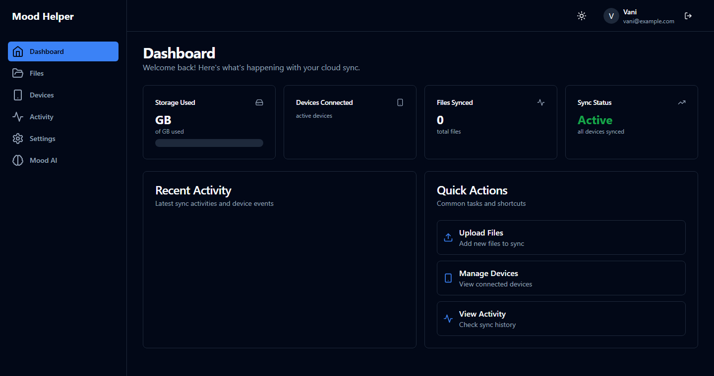
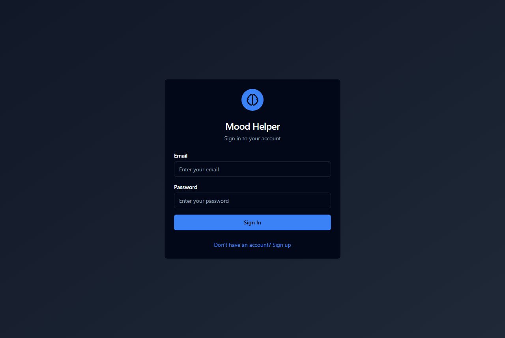
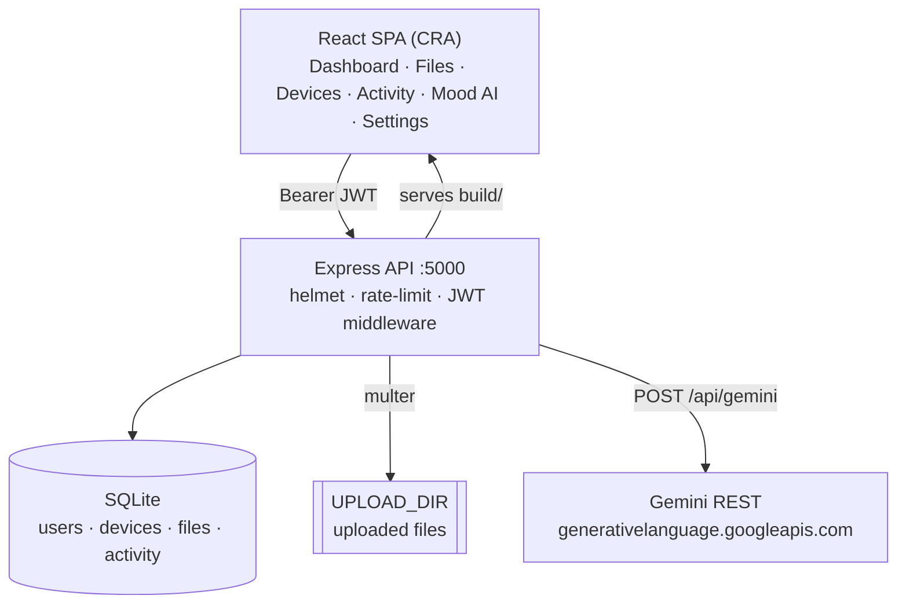

<div align="center">

<pre>
            _
   ___  ___| |__   ___  _ __ ___   ___   ___   __| |
  / _ \/ __| '_ \ / _ \| '_ ` _ \ / _ \ / _ \ / _` |
 |  __/ (__| | | | (_) | | | | | | (_) | (_) | (_| |
  \___|\___|_| |_|\___/|_| |_| |_|\___/ \___/ \__,_|
</pre>

**Cloud file sync across your devices, plus a Gemini-powered mood companion — one dashboard for both.**

The app titles itself **Mood Helper**.

<br/>

[](https://react.dev)
[](https://expressjs.com)
[](https://sqlite.org)
[](https://ai.google.dev)
[](https://kubernetes.io)


</div>

---

## 🌥️ What is echomood?

Two things a person juggles daily — their **files** and their **headspace**. echomood puts both behind one login: register your devices, sync files between them, watch storage and activity on a dashboard — and when you need it, tell the **mood companion** how you're feeling and get an empathetic, Gemini-generated reply.

> Cloud sync for your files. AI support for your mind. One dashboard for both.

---

## 📸 The app, running

> Signed in against a live backend seeded with three devices and three synced files — the Dashboard with its sidebar (Files · Devices · Activity · Settings · Mood AI), stat cards, and Quick Actions.



<details>
<summary>Sign-in screen</summary>



</details>

---

## ✨ Features

- 📁 **File sync** — upload / list / download / delete, scoped per user; `UPLOAD_DIR` on disk.
- 💻 **Device registry** — register named devices; the dashboard tracks connections and activity.
- 🧠 **Gemini mood companion** — `POST /api/gemini` sends a free-text mood; the prompt asks for a warm, 2–3-sentence empathetic reply.
- 📊 **Dashboard stats** — `/api/dashboard/stats`, `/storage-breakdown`, `/activity` feed usage charts and an event log.
- 🔐 **JWT auth** — bcrypt hashing, `Bearer` tokens, a `/api/auth/verify` check on load; token kept in `localStorage`.
- 🌗 **Theming** — `ThemeContext` light/dark toggle; Tailwind + Radix UI primitives (shadcn-style `Button`, `Card`, `Tabs`, …).
- 🐳 **Docker Compose** — `docker-compose.yml` for the local stack.
- ☸️ **Kubernetes manifests** — `k8s/` (namespace, frontend, backend, flask-gemini, mysql, redis, ingress, kustomization) for a scaled-out deployment.

---

## 🛠️ Tech Stack

| Layer | Technology |
|:---|:---|
| **Frontend** | React 18 (CRA / react-scripts) · React Router 6 · Tailwind CSS · Radix UI · lucide-react |
| **Backend API** | Node.js · Express · helmet · express-rate-limit · morgan · compression |
| **Database** | SQLite (`backend/database.sqlite`, tables created on boot); `mysql2` is a dependency for the K8s MySQL variant |
| **AI** | Google Gemini REST API — from `backend/routes/gemini.js` (Node); a parallel Flask service (`backend/app.py`) is the container split-out |
| **Auth** | jsonwebtoken · bcryptjs |
| **Uploads** | multer → local `UPLOAD_DIR` |
| **Ops** | Docker · Docker Compose · Kubernetes (`k8s/`) |

---

## 🏗️ Architecture



The Express server also serves the compiled `frontend/build`, so `http://localhost:5000` is the whole app in one origin. `k8s/` splits it into frontend / backend / flask-gemini / mysql / redis pods.

---

## 🔌 API

| Method | Route | Purpose |
|:---|:---|:---|
| `POST` | `/api/auth/register` · `/login` · `/logout` | account + session |
| `GET` | `/api/auth/verify` | validate a token on load |
| `GET` `POST` `DELETE` | `/api/files` · `/api/files/upload` · `/api/files/download/:id` · `/api/files/:id` | file sync |
| `GET` `POST` `PUT` `DELETE` | `/api/devices` · `/api/devices/register` · `/api/devices/:id/status` · `/api/devices/:id` | device registry |
| `GET` | `/api/dashboard/stats` · `/storage-breakdown` · `/activity` | dashboard data |
| `POST` | `/api/gemini` | `{ "mood": "…" }` → empathetic reply |

---

## 🚀 Getting Started

```bash
git clone https://github.com/shaktivijayas/echomood.git
cd echomood
cp env.example .env        # set GEMINI_API_KEY and a strong JWT_SECRET

# backend (also serves the frontend build)
cd backend && npm install && npm start        # http://localhost:5000

# frontend dev server (optional, hot reload)
cd frontend && npm install && npm start        # http://localhost:3000  → talks to :5000
```

Docker: `docker-compose up -d`. Kubernetes: `kubectl apply -f k8s/`.

### Environment

```env
GEMINI_API_KEY=your_key        # https://aistudio.google.com/apikey
JWT_SECRET=long_random_string
PORT=5000
FRONTEND_URL=http://localhost:3000
UPLOAD_DIR=./uploads
```

---

## 📁 Project Structure

```
echomood/
├── frontend/               # React CRA app
│   ├── src/
│   │   ├── pages/          # Login · Dashboard · Files · Devices · Activity · MoodAI · Settings
│   │   ├── components/     # Layout + ui/ (Radix-based Button, Card, Tabs, Progress, …)
│   │   ├── contexts/       # AuthContext · ThemeContext
│   │   └── lib/utils.js
│   ├── build/              # compiled output (committed; served by the backend)
│   ├── Dockerfile · nginx.conf
├── backend/                # Express API
│   ├── server.js           # app wiring + static serve of frontend/build
│   ├── app.py              # parallel Flask Gemini service (for the K8s split)
│   ├── config/database.js  # SQLite connect + table init
│   ├── routes/             # auth · files · devices · dashboard · gemini
│   ├── middleware/auth.js  # JWT verification
│   └── database.sqlite
├── k8s/                    # namespace · frontend · backend · flask-gemini · mysql · redis · ingress
├── docker-compose.yml · env.example
├── API.md · DEPLOYMENT.md
```

---

## 📄 License

MIT (declared in `backend/package.json`; no root `LICENSE` file committed).

---

<div align="center">

`🌥️ files in sync · mind at ease`

</div>
